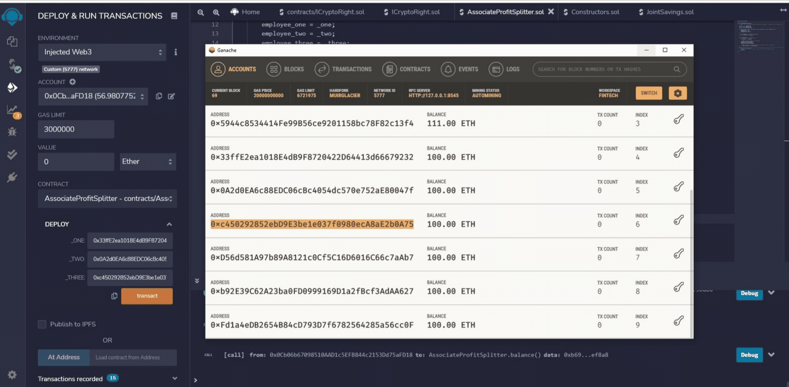
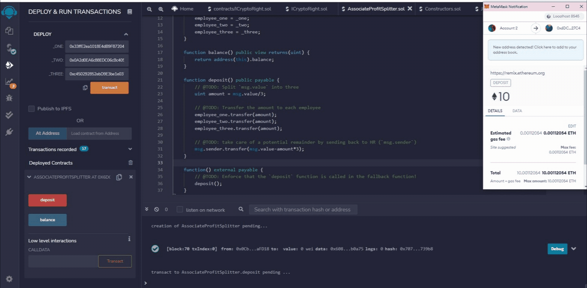
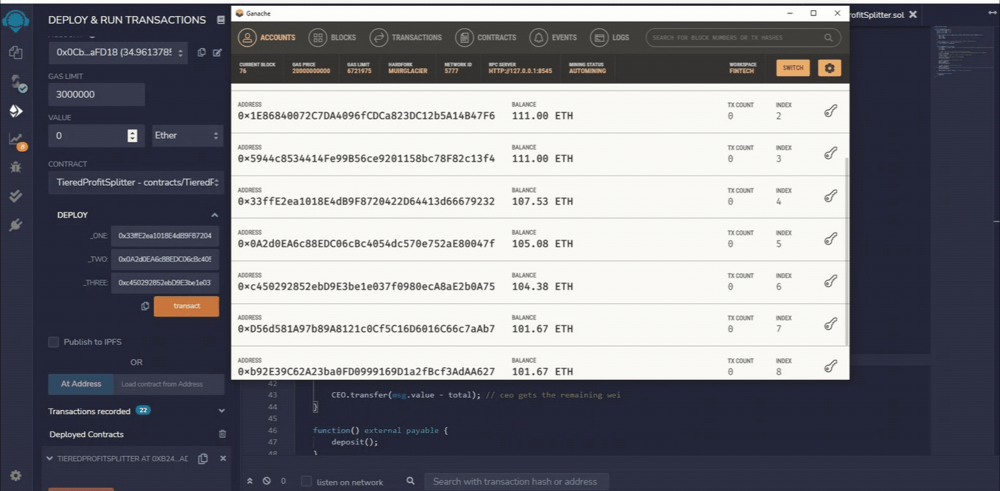

# Looks-like-we-ve-made-our-first-contract
this is my homework for unit 20 smart contract

## AssociateProfitSplitter.sol
This smart contract accepts deposits of Ether and evenly divides and distributes the Ether to the employee-level associates the contract is designed for when initially deployed. This makes the process easier for Human Resources to pay their employees with one input.

How to Use the Smart Contract:

Specify the employee wallet addresses during the initial deployment of the smart contract.

Declare the value to distribute (Eth or wei) before using the deposit function.

You can check the balance of the contract, which should always be zero. Any remaining wei after distributing to the employees will be sent back to the address that created the contract. In this case, HR.

## TieredProfitSplitter.sol
This smart contract accepts deposits of Ether and distributes them according to percentages defined within the contract. Compared to the AssociateProfitSplitter contract, the addresses of the employees are already defined within the contract.

How to Use the Smart Contract:

Declare the value to distribute before using the deposit function.

The amount to be distributed is calculated by multiplying the points/units (msg.value/100) by the the percentage amount (CEO:60,CTO:25,Bob:15).

Send the remainder to the employee with the highest percentage by subtracting `total` from `msg.value`, and sending that to an employee(CEO).

The provided `balance` function can be used as a test to see if the logic you have in the `deposit` function is valid. Since all of the ether should be transferred to employees, this function should always return `0`, since the contract should never store ether itself.

